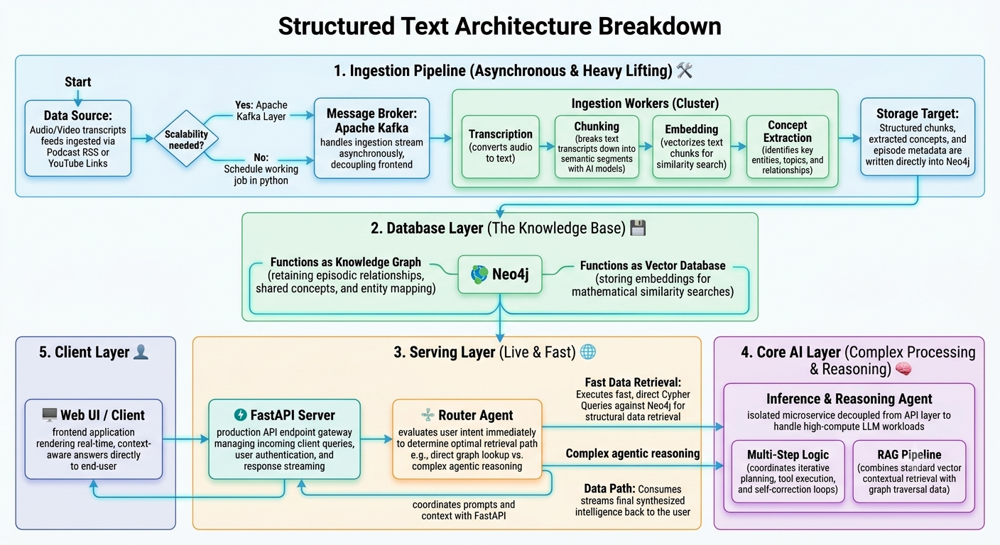

# GraphRAG Podcast AI 🎙️

An agentic AI system that synthesizes insights across multiple podcasts using Neo4j graph database, Apache Kafka streaming, and large language models.

> **Note:** Kafka is only required when scaling to high ingestion volumes. For small-scale or local use, it can be omitted and ingestion can run directly without a message queue.

## 🎯 Vision

Instead of searching episodes one by one, ask cross-podcast questions:
- *"What do Andrew Huberman and Peter Attia say about Metformin for longevity?"*
- *"Which guests discuss sleep optimization?"*
- *"How do recommendations on exercise vary across episodes?"*

The system:
1. **Ingests** podcasts asynchronously (transcription + chunking)
2. **Builds** a knowledge graph (Neo4j) linking concepts across episodes
3. **Answers** user questions with citations (Agentic AI + GraphRAG)

## 🏗️ Architecture



## ⚡ Key Features

- **Async Ingestion:** Background processing doesn't block user queries
- **Cross-Episode Synthesis:** Graph relationships connect insights across shows
- **Cost-Optimized:** Local embeddings + cheap LLMs = pennies per episode
- **Production-Ready:** Docker, CI/CD, comprehensive testing
- **Agentic AI:** Agents understand your question → generate queries → synthesize answers

## 🚀 Quick Start

### Prerequisites
- Docker & Docker Compose
- Python 3.11+
- Git

### Run Locally (5 minutes)

```bash
# Clone repo
git clone https://github.com/YOUR_USERNAME/graphrag-podcast-ai.git
cd graphrag-podcast-ai

# Start all services
make up

# Wait for services to be healthy (~30s)
docker compose ps

# Test the API
curl http://localhost:8000/health

# Visit Neo4j Browser
# http://localhost:7474
# Username: neo4j
# Password: testpassword123

# View API documentation
# http://localhost:8000/docs

# Stop everything
make down
```

## 📚 Documentation

- **[ARCHITECTURE.md](docs/ARCHITECTURE.md)** — Deep dive into each component
- **[GRAPH_SCHEMA.md](docs/GRAPH_SCHEMA.md)** — Neo4j nodes and relationships
- **[AGENTS.md](docs/AGENTS.md)** — How LLM agents work
- **[API.md](docs/API.md)** — Full API endpoint reference

## 🔄 Development Workflow

```bash
# Install dependencies
make install

# Start services
make up

# Run tests
make test

# Format code
make format

# View logs
make logs
```

## 🧪 Testing

```bash
# Run all tests
make test

# Run specific test file
pytest src/tests/test_graph_schema.py -v

# With coverage report
pytest src/tests -v --cov=src --cov-report=html
```

## 📦 Project Structure

```
graphrag-podcast-ai/
├── src/
│   ├── query/         # FastAPI server
│   ├── ingestion/     # Kafka workers
│   ├── agents/        # LLM agents
│   ├── setup/         # Database initialization
│   └── tests/         # Test suite
├── config/            # Configuration files
├── docs/              # Documentation
├── docker-compose.yml # Service orchestration
├── Makefile           # Common commands
└── pyproject.toml     # Python dependencies
```

## 🤝 Contributing

This is a personal portfolio project. Feel free to fork and adapt!

To understand the codebase:
1. Read [ARCHITECTURE.md](docs/ARCHITECTURE.md)
2. Explore Phase 1 code in `src/setup/` and `src/query/`
3. Check test files for usage examples

## 📝 License

Apache License — Feel free to use this as a template.

