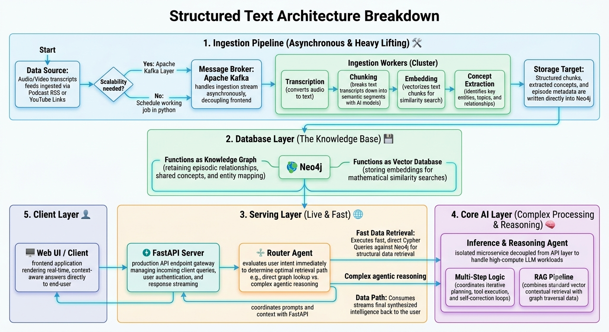

# GraphRAG Podcast AI 🎙️

An agentic AI system that synthesizes insights across multiple podcasts using a Neo4j knowledge graph, local embeddings, and LLM agents orchestrated with LangGraph.

> **Note:** Kafka is only required when scaling to high ingestion volumes. For small-scale or local use it is omitted and ingestion runs directly — the pipeline keeps a clean seam where a broker would slot in.

## 🎯 Vision

Instead of searching episodes one by one, ask cross-podcast questions:
- *"What is open source recommended for, according to the guests?"*
- *"When did Alex Mashrab talk about accounting, and on which podcast?"*
- *"Which topics do both shows discuss?"*

The system:
1. **Ingests** podcasts (YouTube captions or transcript files) through a LangGraph of specialised agents: semantic chunking, speaker attribution, concept extraction, relation extraction
2. **Builds** a knowledge graph (Neo4j) with a curated concept bank linking topics across episodes and shows
3. **Answers** user questions with citations — show, episode, timestamp (Agentic AI + GraphRAG)

Real example, real transcripts (two YouTube episodes: *Beyond Coding* and *Silicon Valley Girl*):

```
POST /query {"question": "What is open source recommended for, according to the guests?"}

→ Open source is recommended for several key reasons. It provides valuable experience and skill
  development, which can lead to career opportunities (Beyond Coding — Why World Class Engineers
  Get Jobs on Easy Mode, 08:08). Additionally, it fosters innovation and problem-solving by allowing
  contributors to tackle real-world issues collaboratively (…, 03:49). The community aspect creates
  networking opportunities and builds trust among contributors (…, 21:10).
```

The router agent picks a different path per question — no endpoint to choose, no query to write:

```
POST /query {"question": "find the guests of beyond coding"}
                                                    → router wrote Cypher over HAS_EPISODE / APPEARED_IN
→ The guest listed for Beyond Coding is Bruno Schaatsbergen (Beyond Coding).

POST /query {"question": "what is Patrick opinion about first contribution"}
                                                → router fell back to meaning-based retrieval
→ Patrick says his first contribution was a "quickly-merged" addition that let him unblock his work
  at Adidas, which felt "quite satisfying" and put him in a strong consulting position (Beyond Coding
  — Why World Class Engineers Get Jobs on Easy Mode, 05:45). He also notes that a first-time pull
  request — such as fixing a typo in a README — is a good way to become familiar with the
  contribution process (…, 12:54).
```

*Patrick* is the host and is never labelled in the captions; the timestamps come off the
`MENTIONS {speaker, start}` edges — so every claim is a citation, not a paraphrase.

## 🏗️ Architecture



**Ingestion — a LangGraph, one node per agent**

```
segment ─▶ embed ─▶ analyse ─▶ resolve_concepts ─▶ recommend ─▶ write        (--no-llm: segment ─▶ embed ─▶ write)
```

| Node | Agent | What it produces |
|---|---|---|
| `segment` | LLM topic-boundary detection over numbered captions | topic-sized chunks, each one coherent discussion |
| `embed` | `all-MiniLM-L6-v2`, local, 384-d | `Chunk.embedding` in Neo4j's native vector index |
| `analyse` | one typed call per chunk | chunk **topic**, **summary**, **speaker turns** with timestamps, concept candidates |
| `resolve_concepts` | concept bank: vector match ≥0.92 reuse · 0.80–0.92 LLM confirm · else add | one `Concept` node per real topic, shared across shows |
| `recommend` | relation agent over each chunk's concepts | `(Concept)-[:RECOMMENDS {reason, chunk_id}]->(Concept)`, grounded in the passage |
| `write` | idempotent Cypher (`MERGE` on deterministic ids) | the graph, plus an `IngestRun` audit node per run |

**Graph:** `Podcast-HAS_EPISODE->Episode`, `Guest-APPEARED_IN->Episode`, `Episode-CONTAINS->Chunk`, `Chunk-MENTIONS {speaker, start, quote}->Concept`, `Concept-RECOMMENDS->Concept`.

**Query — retrieval is "vector to find, graph to connect":** a semantic hit immediately knows which show, episode, speaker and second. `POST /query` runs a router agent (picks a graph tool, or writes read-only Cypher with one self-correction round) and a synthesis agent (answers only from the retrieved evidence, with citations); answers are cached in the graph.

## ⚡ Key Features

- **Semantic chunks:** an LLM marks topic changes, so each chunk is a coherent discussion with a title and summary, not a 1000-character window
- **Who said what, when:** captions carry no speaker labels; the analyser is told who is in the room and every mention carries `speaker` + timestamp → *"when did X talk about Y, on which show"* is a one-pattern query
- **Concept bank:** candidate concepts are embedded and matched against existing ones, so the same topic from different shows is one node — cross-podcast synthesis actually joins
- **Grounded relations:** `RECOMMENDS` edges only between concepts of the same passage, each with a reason and the passage as evidence
- **Cross-Episode Synthesis:** graph queries that keyword or vector search structurally cannot do — shared guests, topics spanning shows, guests bridging two topics
- **Cost-Optimized:** local embeddings, no separate vector DB, LLM calls on **Groq's free tier** ($0) — tasks spread over three models because Groq's limits are per model
- **Safe agentic Cypher:** LLM-written queries are keyword-checked and executed in a read transaction; failures fall back to semantic retrieval
- **Production-Ready:** Docker, GitHub Actions (Neo4j service container + GHCR image), idempotent self-healing ingestion, tests at two layers

## 🚀 Quick Start

### Prerequisites
- Docker & Docker Compose
- Python 3.12 (< 3.15)
- A [Groq](https://console.groq.com) API key (free, no card)

### Run Locally

```bash
git clone <your fork>
cd PodGraph

cp .env.example .env            # add GROQ_API_KEY; API_PORT defaults to 8010
make up                         # Neo4j (http://localhost:7474, no auth)
make install                    # poetry install (PyTorch CPU, ~2 GB, one-time)
make init-db                    # constraints + vector indexes
make ingest-sample              # the two saved real episodes through the LangGraph (~15 min on Groq's free tier)
make api                        # http://localhost:8010/docs

# Ask a question
curl -X POST localhost:8010/query -H 'content-type: application/json' \
     -d '{"question": "Which topics do both shows discuss?"}'

make down                       # stop everything
```

Add any episode that has YouTube captions (no YouTube key; host/guest are inferred if omitted):

```bash
poetry run python -m src.ingestion.pipeline youtube VIDEO_ID --podcast "Show name" [--host ... --guest ...]
```
The transcript is saved to `data/transcripts/` so the graph can be rebuilt offline.

## 🧠 What the graph buys you

| Endpoint | Question | Why plain search can't |
|---|---|---|
| `POST /query` | free-form question → cited answer | router agent + graph tools + synthesis |
| `GET /people/{name}/mentions?concept=` | when did *person* talk about *X*, on which show | `MENTIONS {speaker, start}` |
| `GET /concepts/{name}/recommendations` | what is *X* recommended for / by | `RECOMMENDS` with reason + passage |
| `GET /insights/concept-reach` | which topics span both shows | aggregation over the concept bank |
| `GET /insights/shared-guests` | who appeared on more than one show | join via `APPEARED_IN` |
| `GET /insights/bridge-guests?concept_a=&concept_b=` | whose episodes touch *both* topics | multi-hop path |
| `GET /insights/semantic-compare?q=` | what does *each* show say about this, any phrasing | vector finds, graph groups |
| `GET /search/semantic?q=` | meaning-based passage search with show/episode/speaker | vector index + traversal in one query |

Keyword vs meaning on the real data: `GET /search?term=hiring` finds 1 passage; `GET /search/semantic?q=how to get hired as an engineer` finds the hiring anecdotes from both shows — none needed the word.

## 📚 Documentation

- **[ARCHITECTURE.md](docs/ARCHITECTURE.md)** — the LangGraph nodes, the Kafka seam, query flow
- **[GRAPH_SCHEMA.md](docs/GRAPH_SCHEMA.md)** — Neo4j nodes, relationships, indexes
- **[AGENTS.md](docs/AGENTS.md)** — the five ingestion agents, the concept bank, the router and synthesis agents
- **[API.md](docs/API.md)** — full endpoint reference
- **[DEPLOYMENT.md](docs/DEPLOYMENT.md)** — single-VPS deployment with Docker Compose

## 🔄 Development Workflow

```bash
make install        # dependencies
make up             # Neo4j
make api            # API with reload on :8010
make test           # tests (live layer auto-skips without Neo4j)
make lint / format  # flake8 / black
make logs           # container logs
make reset-db       # wipe every node, keep the schema
make backfill       # embed chunks/concepts that lack vectors
```

## 🧪 Testing

```bash
make test                                   # both layers, with coverage
pytest src/tests/test_unit.py -v            # no Neo4j, no model, no LLM — everything faked
pytest src/tests/test_live.py -v            # needs Neo4j + ingested data; no LLM calls
```

CI ingests the saved transcripts (`--no-llm`) into a Neo4j service container, runs the suite, and on `main` pushes the API image to GHCR.

## 📦 Project Structure

```
PodGraph/
├── src/
│   ├── ingestion/     # models · sources (file, YouTube) · chunker · embedder · graph_writer · pipeline (LangGraph + CLI)
│   ├── agents/        # llm (LangChain client + typed ingestion agents) · qa (router → tool → synthesis, cache)
│   ├── query/         # api (FastAPI) · repository (all Cypher) · schemas · db (drivers)
│   ├── setup/         # init_neo4j (schema)
│   └── tests/         # test_unit · test_live
├── config/            # neo4j_schema.cypher — constraints + vector indexes
├── data/transcripts/  # real transcripts fetched from YouTube, kept for offline rebuilds
├── docs/              # documentation + example Cypher queries
├── docker-compose.yml # Neo4j, API (Kafka defined, unused)
├── Makefile           # common commands
└── pyproject.toml     # dependencies (Poetry)
```

## ⚠️ Known limits
- Groq's free tier caps each model at 8k tokens/min; ingestion throttles itself via retries, so a long episode takes ~10 min. 

## 🤝 Contributing

This is a personal portfolio project. Feel free to fork and adapt!

To understand the codebase:
1. Read [ARCHITECTURE.md](docs/ARCHITECTURE.md)
2. Follow one episode through `src/ingestion/pipeline.py`
3. Read `src/agents/qa.py` to see how a question becomes a cited answer

## 📝 License

Apache License — Feel free to use this as a template.
