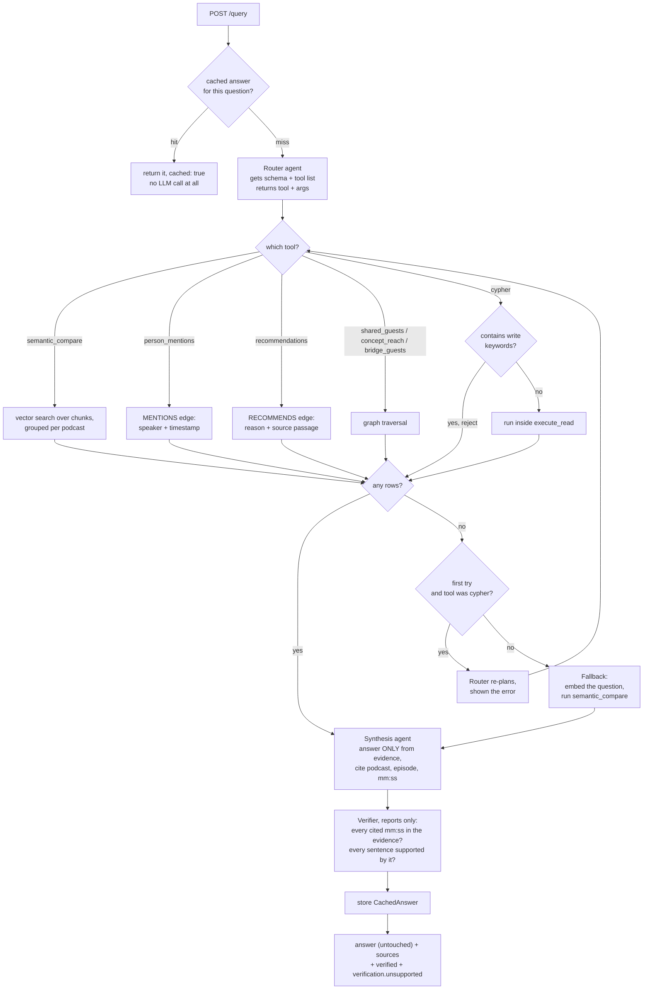

# Architecture

## Ingestion — a LangGraph, one node per agent

```
segment ─▶ embed ─▶ analyse ─▶ resolve_concepts ─▶ recommend ─▶ write        (--no-llm: segment ─▶ embed ─▶ write)
```

| node | what | how |
|---|---|---|
| `segment` | semantic chunking | LLM marks topic changes in ~8k-char windows of numbered captions; over-long topics split at 2500 chars on caption boundaries |
| `embed` | vectors | `all-MiniLM-L6-v2`, 384-d, CPU, local |
| `analyse` | per chunk: topic, summary, speaker turns, concept candidates | one typed LLM call per chunk (`LLM_PARALLEL` at a time); turns aligned to captions for timestamps |
| `resolve_concepts` | concept bank | each candidate name is embedded and matched against `concept_embedding_index`: ≥0.92 reuse · 0.80–0.92 LLM "same concept?" · else add to bank |
| `recommend` | `RECOMMENDS` relations | per chunk, only between its resolved concepts, with a reason and the chunk as evidence |
| `write` | Neo4j | idempotent MERGE by deterministic ids; tags/relations replaced on re-ingest; `IngestRun` audit |

The state passed between nodes is a `Transcript` plus `list[Chunk]` (Pydantic) — the same objects a Kafka
message would carry, so the seam between `recommend` and `write` is where a broker would slot in.

**Why LangGraph:** the design is a small state machine with one agent per job; `StateGraph` expresses
exactly that and keeps each agent a plain typed function. Parallelism is inside a node
(`asyncio.gather`, semaphore of `LLM_PARALLEL`) rather than graph fan-out — same speed, far less state plumbing.
**Why no Kafka now:** a handful of episodes on demand, one at a time, failed runs simply re-run.

**Failure handling:** the LLM clients retry transient errors and rate limits (5×); YouTube fetch retries 3×. Every run —
success or failure — appends an `IngestRun` node (`docs/queries/ingest_history.cypher`).

## Query (live, async driver)

```
FastAPI endpoint → GraphRepository (one per request, bound to an async session) → Neo4j
```

All Cypher lives in `src/query/repository.py`. CPU-bound work in async handlers (embedding a query,
calling the LLM) runs via `asyncio.to_thread` so the event loop never blocks.

Semantic search is one query: `db.index.vector.queryNodes` finds chunks, then a `MATCH` walks to
episode, podcast and guest. That's the GraphRAG core — no second lookup system.

### Retrieval flow — `POST /query` (a LangGraph, `src/agents/qa.py`)

Three LLM calls (router, synthesis, verifier; plus one re-plan when generated Cypher fails); everything
else is Cypher.



**The `any rows?` gate is the important one.** A tool that finds nothing is a *routing* failure, not an
answer — the router may have invented a concept name that isn't in the bank, or misspelt a guest. Every
tool funnels through that one check (`src/agents/qa.py`), so an empty result always reaches the fallback
instead of reaching the synthesis agent, which would faithfully reply "the evidence does not answer the
question." Vector search needs no exact names, so it is the one path that can't miss for this reason.

**Worked example** — *"charging by hour is it ok?"*

| step | what happens |
|---|---|
| router | picks `recommendations(concept="charging by hour")` — a name it invented from the question |
| tool | the bank holds `Pricing`, `Billing`, `Payment` — no such concept → `[]` |
| gate | empty → routing failure, not cypher → fall back |
| fallback | question embedded; nearest chunk scores **0.79** on *"paying by output … is the right play"* despite sharing almost no words |
| synthesis | answers with citations at 19:13 and 19:27 of the Silicon Valley Girl episode |

Opinion questions (*"is X ok?"*) and any question whose topic isn't literally a node name belong on the
semantic path; the router prompt says so, and the gate catches it when the router forgets.

## Agents

See [AGENTS.md](AGENTS.md). `POST /query` = cache check → router agent → one graph tool → synthesis agent →
verifier agent (reports, never edits) → cache.

## Storage

Neo4j holds everything: the knowledge graph, the vectors (native vector index), the ingest audit
trail and the answer cache. One database, one backup, no extra services.
